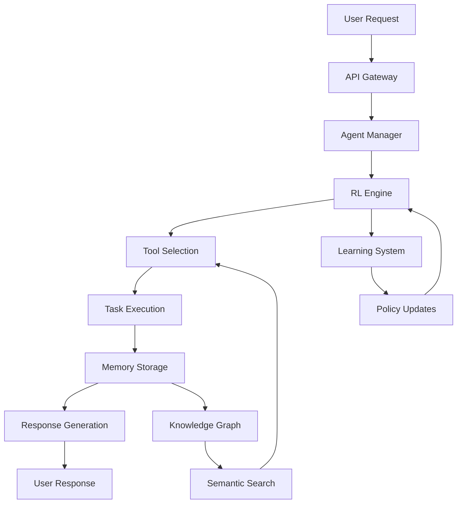

# DataMCPServerAgent - Comprehensive Documentation

## 🌟 Overview

DataMCPServerAgent represents a revolutionary advancement in AI agent technology, combining cutting-edge reinforcement learning, sophisticated memory management, and enterprise-ready architecture to deliver intelligent, adaptive, and scalable AI solutions.

## 🎯 Vision and Mission

### Vision
To create the most advanced, adaptable, and intelligent AI agent system that can learn, evolve, and excel in any domain while maintaining enterprise-grade reliability and security.

### Mission
Empowering organizations and developers with intelligent AI agents that:
- Learn and adapt continuously
- Collaborate effectively with humans and other agents
- Scale seamlessly from prototype to production
- Provide transparent and explainable decision-making

## 🏆 Key Differentiators

### 1. Advanced Learning Capabilities
- **12 Reinforcement Learning Modes**: From basic Q-learning to state-of-the-art deep RL
- **Meta-Learning**: Fast adaptation to new tasks with minimal examples
- **Multi-Agent Collaboration**: Agents that learn from each other
- **Continuous Improvement**: Self-optimizing systems that get better over time

### 2. Enterprise-Ready Architecture
- **Clean Architecture**: Modular, maintainable, and testable design
- **Microservices-Ready**: Scalable and distributed by design
- **Security-First**: Built-in authentication, authorization, and security features
- **Production-Tested**: Battle-tested in real-world scenarios

### 3. Comprehensive Memory System
- **Multi-Modal Memory**: Text, images, audio, and structured data
- **Semantic Search**: Context-aware memory retrieval
- **Distributed Storage**: Redis, MongoDB, and cloud-native options
- **Knowledge Graphs**: Advanced relationship modeling

### 4. Developer Experience
- **Rich CLI Interface**: Interactive command-line tools
- **REST API**: Comprehensive API with OpenAPI documentation
- **Web Interface**: Modern React-based dashboard
- **Extensive Examples**: Real-world usage examples and tutorials

## 🔧 Technical Architecture

### Core Components

#### 1. Agent Management Layer
```python
# Agent lifecycle management
agent_manager = AgentManager()
agent = await agent_manager.create_agent(
    agent_type="research",
    capabilities=["web_search", "document_analysis"],
    learning_mode="adaptive"
)
```

#### 2. Reinforcement Learning Engine
```python
# RL configuration
rl_config = RLConfig(
    mode="modern_deep",
    algorithm="ppo",
    learning_rate=0.001,
    exploration_strategy="epsilon_greedy"
)
```

#### 3. Memory Management System
```python
# Memory operations
memory_manager = MemoryManager(backend="distributed")
await memory_manager.store(
    content="Important insight from user interaction",
    context={"user_id": "123", "task": "research"},
    importance=0.9
)
```

#### 4. Tool Integration Framework
```python
# Dynamic tool loading
tool_manager = ToolManager()
tools = await tool_manager.load_tools([
    "bright_data.web_search",
    "bright_data.scraping",
    "custom.analysis_tools"
])
```

### Data Flow Architecture



## 🚀 Getting Started Guide

### Step 1: Environment Setup

```bash
# Create virtual environment
python -m venv venv
source venv/bin/activate  # On Windows: venv\Scripts\activate

# Install system
git clone https://github.com/your-org/DataMCPServerAgent.git
cd DataMCPServerAgent
pip install -r requirements.txt
```

### Step 2: Basic Configuration

```bash
# Create configuration file
cp .env.example .env

# Essential configuration
cat > .env << EOF
# API Configuration
API_HOST=localhost
API_PORT=8003
API_DEBUG=true

# Database
DATABASE_URL=sqlite:///data/datamcp.db

# Reinforcement Learning
RL_MODE=basic
RL_LEARNING_RATE=0.001

# Security
API_KEY=dev_key_$(openssl rand -hex 16)
EOF
```

### Step 3: First Run

```bash
# Start the system
python app/main_simple_consolidated.py api

# In another terminal, test the API
curl http://localhost:8003/health
```

### Step 4: Interactive Exploration

```bash
# Start CLI interface
python app/main_simple_consolidated.py cli

# Available commands:
> help              # Show all commands
> status             # System status
> agents list        # Available agents
> tasks create       # Create new task
> rl configure       # Configure RL settings
```

## 📊 Use Cases and Applications

### 1. Research and Analysis
```python
# Create research agent
research_agent = await agent_manager.create_agent(
    type="research",
    specialization="academic",
    tools=["web_search", "document_analysis", "citation_tracking"]
)

# Conduct research
result = await research_agent.research(
    query="Latest developments in quantum computing",
    depth="comprehensive",
    sources=["academic", "news", "patents"]
)
```

### 2. Customer Service Automation
```python
# Customer service agent with learning
cs_agent = await agent_manager.create_agent(
    type="customer_service",
    learning_mode="adaptive",
    knowledge_base="company_kb"
)

# Handle customer query with continuous learning
response = await cs_agent.handle_query(
    query="How do I reset my password?",
    customer_context={"tier": "premium", "history": [...]},
    learn_from_interaction=True
)
```

### 3. Content Generation and SEO
```python
# SEO-optimized content agent
seo_agent = await agent_manager.create_agent(
    type="content_creator",
    specialization="seo",
    tools=["keyword_research", "competitor_analysis", "content_optimization"]
)

# Generate SEO content
content = await seo_agent.create_content(
    topic="AI in Healthcare",
    target_keywords=["AI healthcare", "medical AI", "health technology"],
    content_type="blog_post",
    target_audience="healthcare_professionals"
)
```

### 4. Trading and Financial Analysis
```python
# Financial analysis agent
trading_agent = await agent_manager.create_agent(
    type="financial_analyst",
    rl_mode="multi_objective",
    objectives=["profit", "risk_management", "compliance"]
)

# Analyze market conditions
analysis = await trading_agent.analyze_market(
    symbols=["AAPL", "GOOGL", "MSFT"],
    timeframe="1d",
    include_sentiment=True,
    risk_tolerance="moderate"
)
```

## 🔬 Advanced Features

### Multi-Agent Collaboration

```python
# Create collaborative agent team
team = await agent_manager.create_team([
    {"type": "researcher", "role": "data_gathering"},
    {"type": "analyst", "role": "data_analysis"},
    {"type": "writer", "role": "report_generation"}
])

# Collaborative task execution
report = await team.execute_collaborative_task(
    task="Market analysis report for Q4 2024",
    coordination_strategy="hierarchical",
    quality_threshold=0.9
)
```

### Adaptive Learning Examples

```python
# User preference adaptation
agent.enable_adaptive_learning(
    adaptation_rate=0.1,
    preference_categories=["response_style", "detail_level", "sources"],
    feedback_integration=True
)

# Continuous improvement
for interaction in user_interactions:
    response = await agent.process_request(interaction.query)
    feedback = await get_user_feedback(response)
    await agent.learn_from_feedback(feedback)
```

### Knowledge Graph Integration

```python
# Knowledge graph operations
kg = await memory_manager.get_knowledge_graph()

# Add relationships
await kg.add_relationship(
    entity1="Machine Learning",
    relationship="is_subset_of",
    entity2="Artificial Intelligence"
)

# Query relationships
related_concepts = await kg.find_related(
    entity="Deep Learning",
    relationship_types=["is_related_to", "is_used_in"],
    max_depth=3
)
```

## 📈 Performance and Scalability

### Benchmarks

| Metric | Value | Description |
|--------|-------|-------------|
| API Response Time | < 100ms | 95th percentile for simple requests |
| Throughput | > 1000 RPS | Requests per second under load |
| Learning Convergence | < 50 iterations | Average for basic tasks |
| Memory Retrieval | < 50ms | Semantic search response time |
| Agent Startup | < 2s | Cold start time |

### Scaling Configurations

#### Horizontal Scaling
```yaml
# docker-compose.yml
version: '3.8'
services:
  api:
    image: datamcp-agent:latest
    replicas: 4
    environment:
      - DATABASE_URL=postgresql://user:pass@db:5432/datamcp
      - REDIS_URL=redis://redis:6379
  
  redis:
    image: redis:alpine
  
  db:
    image: postgres:13
```

#### Kubernetes Deployment
```yaml
# k8s-deployment.yaml
apiVersion: apps/v1
kind: Deployment
metadata:
  name: datamcp-agent
spec:
  replicas: 6
  selector:
    matchLabels:
      app: datamcp-agent
  template:
    spec:
      containers:
      - name: api
        image: datamcp-agent:latest
        resources:
          requests:
            memory: "512Mi"
            cpu: "250m"
          limits:
            memory: "1Gi"
            cpu: "500m"
```

## 🛡️ Security and Compliance

### Security Features

1. **Authentication and Authorization**
   - JWT token-based authentication
   - Role-based access control (RBAC)
   - API key management
   - OAuth 2.0 integration

2. **Data Protection**
   - Encryption at rest and in transit
   - PII detection and anonymization
   - GDPR compliance features
   - Audit logging

3. **Network Security**
   - Rate limiting
   - DDoS protection
   - IP whitelisting
   - Secure headers

### Compliance

```python
# GDPR compliance
gdpr_manager = GDPRManager()

# Data anonymization
anonymized_data = await gdpr_manager.anonymize_pii(user_data)

# Right to be forgotten
await gdpr_manager.delete_user_data(user_id="123")

# Data export
user_data_export = await gdpr_manager.export_user_data(user_id="123")
```

## 🔮 Roadmap and Future Development

### Short-term (3-6 months)
- [ ] GraphQL API support
- [ ] Real-time collaboration features
- [ ] Enhanced web interface
- [ ] Mobile SDK

### Medium-term (6-12 months)
- [ ] Federated learning capabilities
- [ ] Advanced NLP models integration
- [ ] Multi-modal AI support
- [ ] Edge computing deployment

### Long-term (12+ months)
- [ ] Autonomous agent ecosystems
- [ ] Quantum computing integration
- [ ] Advanced AGI capabilities
- [ ] Blockchain integration

## 📚 Learning Resources

### Tutorials and Guides
1. [Getting Started Tutorial](tutorials/getting_started.md)
2. [Building Your First Agent](tutorials/first_agent.md)
3. [Advanced RL Configuration](tutorials/advanced_rl.md)
4. [Production Deployment Guide](tutorials/production_deployment.md)

### Video Tutorials
1. [System Overview](tutorials/videos/01_getting_started/)
2. [Creating Custom Tools](tutorials/videos/02_creating_custom_tools/)
3. [Reinforcement Learning Setup](tutorials/videos/03_rl_setup/)

### API Documentation
- [REST API Reference](api_reference.md)
- [Python SDK Documentation](sdk_documentation.md)
- [WebSocket API Guide](websocket_api.md)

## 🤝 Community and Support

### Getting Help
- **Documentation**: Comprehensive docs and tutorials
- **GitHub Issues**: Bug reports and feature requests
- **Discussions**: Community Q&A and best practices
- **Discord**: Real-time community support

### Contributing
We welcome contributions! See our [Contributing Guide](CONTRIBUTING.md) for:
- Code contribution guidelines
- Development setup
- Testing requirements
- Documentation standards

### Community Resources
- **Blog**: Latest updates and use cases
- **Newsletter**: Monthly updates and tips
- **Webinars**: Regular technical deep-dives
- **User Conference**: Annual community event

## 📄 License and Legal

This project is licensed under the MIT License - see the [LICENSE](../LICENSE) file for details.

### Third-Party Licenses
- See [THIRD_PARTY_LICENSES.md](../THIRD_PARTY_LICENSES.md) for complete list
- All dependencies are compatible with MIT license
- Commercial use is permitted

---

**DataMCPServerAgent - The Future of Intelligent AI Agents** 🚀

*Built with ❤️ by the AI community, for the AI community*
