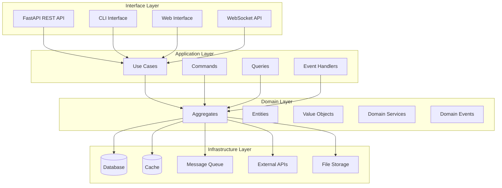
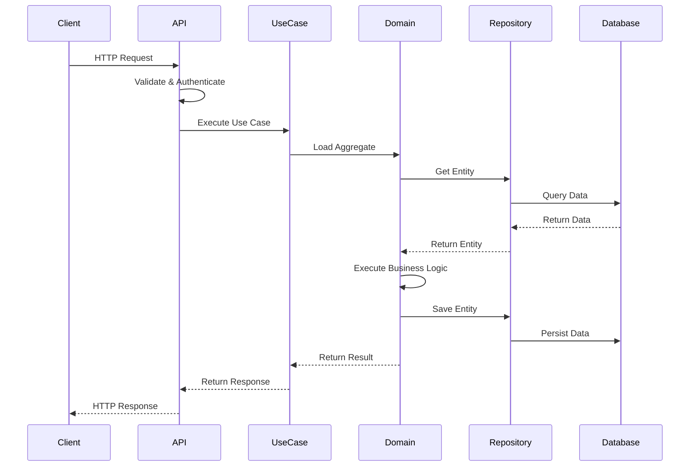
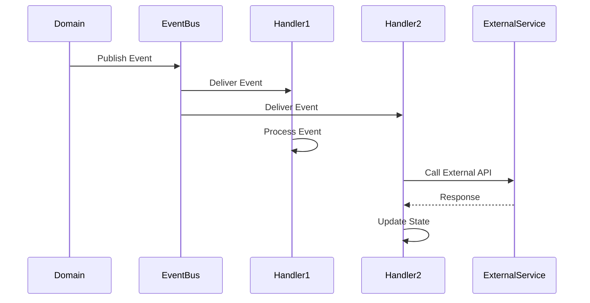
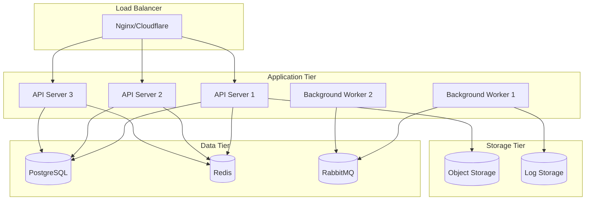

# 🏗️ DataMCPServerAgent v2.0 System Architecture

## 📋 Overview

DataMCPServerAgent v2.0 implements a modern, scalable architecture based on Clean Architecture principles, Domain-Driven Design (DDD), and microservices patterns. The system is designed for high performance, maintainability, and extensibility.

## 🎯 Architectural Principles

### 1. **Clean Architecture**
- **Dependency Inversion**: High-level modules don't depend on low-level modules
- **Separation of Concerns**: Each layer has a single responsibility
- **Testability**: Easy to test each component in isolation
- **Framework Independence**: Business logic independent of frameworks

### 2. **Domain-Driven Design**
- **Ubiquitous Language**: Shared vocabulary between developers and domain experts
- **Bounded Contexts**: Clear boundaries between different domains
- **Aggregates**: Consistency boundaries for business operations
- **Domain Events**: Loose coupling through event-driven communication

### 3. **SOLID Principles**
- **Single Responsibility**: Each class has one reason to change
- **Open/Closed**: Open for extension, closed for modification
- **Liskov Substitution**: Subtypes must be substitutable for base types
- **Interface Segregation**: Clients shouldn't depend on unused interfaces
- **Dependency Inversion**: Depend on abstractions, not concretions

## 🏛️ System Architecture Layers



### Layer Descriptions

#### 🌐 Interface Layer
**Responsibility**: Handle external interactions and user interfaces

- **FastAPI REST API**: RESTful endpoints for programmatic access
- **CLI Interface**: Command-line interface for operations and management
- **Web Interface**: Browser-based user interface
- **WebSocket API**: Real-time bidirectional communication

#### 🔄 Application Layer
**Responsibility**: Orchestrate business operations and coordinate between layers

- **Use Cases**: High-level business operations
- **Commands**: State-changing operations (CQRS pattern)
- **Queries**: Data retrieval operations (CQRS pattern)
- **Event Handlers**: Process domain events

#### 🧠 Domain Layer
**Responsibility**: Contain business logic and rules

- **Aggregates**: Consistency boundaries (Agent, Task, User)
- **Entities**: Objects with identity and lifecycle
- **Value Objects**: Immutable objects without identity
- **Domain Services**: Business logic that doesn't belong to entities
- **Domain Events**: Notifications of important business occurrences

#### 🔧 Infrastructure Layer
**Responsibility**: Provide technical capabilities and external integrations

- **Database**: Data persistence (PostgreSQL, SQLite)
- **Cache**: High-speed data access (Redis)
- **Message Queue**: Asynchronous communication (RabbitMQ, Redis)
- **External APIs**: Third-party service integrations
- **File Storage**: Document and media storage (S3, Cloudflare R2)

## 🏢 Domain Model

### Core Aggregates

#### 🤖 Agent Aggregate
```python
class Agent(AggregateRoot):
    """AI Agent with capabilities and state management."""
    
    # Identity
    id: AgentId
    name: str
    
    # Behavior
    agent_type: AgentType
    capabilities: List[AgentCapability]
    configuration: AgentConfiguration
    
    # State
    status: AgentStatus
    metrics: AgentMetrics
    
    # Lifecycle
    created_at: datetime
    updated_at: datetime
    version: int
```

#### 📋 Task Aggregate
```python
class Task(AggregateRoot):
    """Work unit with lifecycle and progress tracking."""
    
    # Identity
    id: TaskId
    name: str
    
    # Assignment
    agent_id: AgentId
    task_type: TaskType
    priority: TaskPriority
    
    # Execution
    status: TaskStatus
    progress: TaskProgress
    result: Optional[TaskResult]
    
    # Dependencies
    dependencies: List[TaskDependency]
    
    # Lifecycle
    created_at: datetime
    started_at: Optional[datetime]
    completed_at: Optional[datetime]
```

#### 👤 User Aggregate
```python
class User(AggregateRoot):
    """System user with authentication and authorization."""
    
    # Identity
    id: UserId
    username: str
    email: str
    
    # Authentication
    password_hash: str
    api_keys: List[ApiKey]
    sessions: List[Session]
    
    # Authorization
    role: Role
    permissions: Set[Permission]
    
    # Profile
    profile: UserProfile
    preferences: UserPreferences
```

### Domain Events

```python
# Agent Events
class AgentCreated(DomainEvent): ...
class AgentStatusChanged(DomainEvent): ...
class AgentCapabilityAdded(DomainEvent): ...

# Task Events
class TaskCreated(DomainEvent): ...
class TaskStarted(DomainEvent): ...
class TaskCompleted(DomainEvent): ...
class TaskFailed(DomainEvent): ...

# User Events
class UserRegistered(DomainEvent): ...
class UserLoggedIn(DomainEvent): ...
class PermissionGranted(DomainEvent): ...
```

## 🔄 Data Flow Architecture

### Request Processing Flow



### Event Processing Flow



## 🔧 Technology Stack

### Core Technologies
- **Python 3.9+**: Primary programming language
- **FastAPI**: Web framework for APIs
- **Pydantic**: Data validation and serialization
- **SQLAlchemy**: ORM and database toolkit
- **Alembic**: Database migration tool

### Infrastructure
- **PostgreSQL**: Primary database
- **Redis**: Caching and session storage
- **RabbitMQ**: Message queue for async processing
- **Cloudflare**: CDN, DNS, and edge computing
- **Docker**: Containerization
- **Kubernetes**: Container orchestration

### Monitoring & Observability
- **Prometheus**: Metrics collection
- **Grafana**: Metrics visualization
- **Jaeger**: Distributed tracing
- **Structlog**: Structured logging
- **Sentry**: Error tracking

### Development Tools
- **Black**: Code formatting
- **MyPy**: Static type checking
- **Ruff**: Fast Python linter
- **Pytest**: Testing framework
- **Pre-commit**: Git hooks

## 🚀 Deployment Architecture

### Container Architecture



### Kubernetes Deployment

```yaml
# Deployment structure
apiVersion: apps/v1
kind: Deployment
metadata:
  name: datamcp-api
spec:
  replicas: 3
  selector:
    matchLabels:
      app: datamcp-api
  template:
    spec:
      containers:
      - name: api
        image: datamcp/agent:v2.0.0
        ports:
        - containerPort: 8002
        env:
        - name: DATABASE_URL
          valueFrom:
            secretKeyRef:
              name: datamcp-secrets
              key: database-url
```

## 📊 Performance Characteristics

### Scalability Targets
- **Horizontal Scaling**: 100+ concurrent instances
- **Request Throughput**: 10,000+ requests/second
- **Response Time**: <100ms p95
- **Concurrent Users**: 100,000+

### Resource Requirements
- **CPU**: 2-4 cores per instance
- **Memory**: 2-4 GB per instance
- **Storage**: 100 GB+ for data
- **Network**: 1 Gbps bandwidth

### Availability Targets
- **Uptime**: 99.9% (8.76 hours downtime/year)
- **Recovery Time**: <5 minutes
- **Data Durability**: 99.999999999% (11 9's)

## 🔒 Security Architecture

### Authentication & Authorization
- **JWT Tokens**: Stateless authentication
- **API Keys**: Service-to-service authentication
- **Role-Based Access Control**: Fine-grained permissions
- **Multi-Factor Authentication**: Enhanced security

### Data Protection
- **Encryption at Rest**: AES-256 encryption
- **Encryption in Transit**: TLS 1.3
- **Data Masking**: PII protection
- **Audit Logging**: Complete audit trail

### Network Security
- **WAF**: Web Application Firewall
- **DDoS Protection**: Cloudflare protection
- **Rate Limiting**: API rate limiting
- **IP Whitelisting**: Restricted access

## 🔄 Evolution Strategy

### Phase 1: Foundation (Current)
- ✅ Clean Architecture implementation
- ✅ Core domain models
- ✅ Basic API endpoints
- ✅ Database integration

### Phase 2: Enhancement (Next 3 months)
- 🔄 Advanced agent capabilities
- 🔄 Real-time communication
- 🔄 Enhanced monitoring
- 🔄 Performance optimization

### Phase 3: Scale (Next 6 months)
- 📋 Microservices decomposition
- 📋 Event sourcing
- 📋 CQRS implementation
- 📋 Multi-region deployment

### Phase 4: Intelligence (Next 12 months)
- 📋 Machine learning integration
- 📋 Predictive analytics
- 📋 Auto-scaling algorithms
- 📋 Self-healing systems

This architecture provides a solid foundation for building a scalable, maintainable, and extensible AI agent system that can evolve with changing requirements and growing scale.
