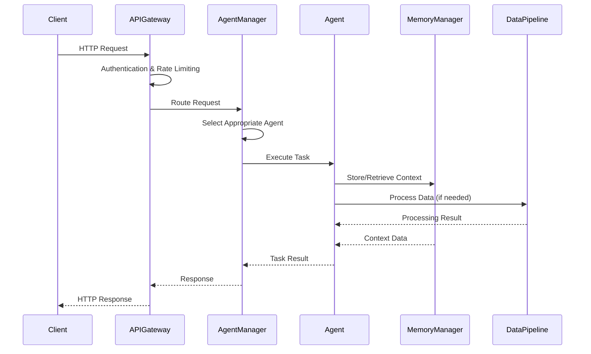
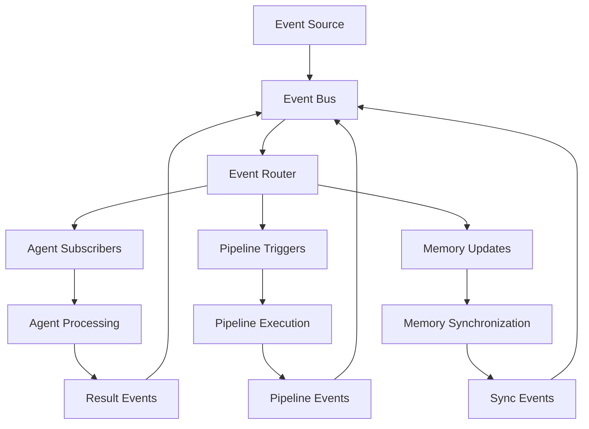
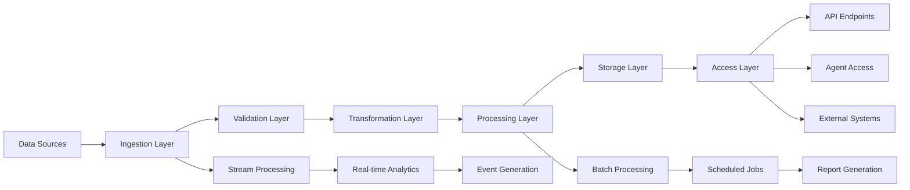

# Data Flow & Integration Architecture

## 📋 Overview

This document details the data flow patterns, integration mechanisms, and communication protocols within the DataMCPServerAgent system. It provides comprehensive coverage of how data moves through the system, how components interact, and how external integrations are managed.

## 🔄 Core Data Flow Patterns

### 1. Request-Response Flow



### 2. Event-Driven Flow



### 3. Data Pipeline Flow



## 🔌 Integration Patterns

### 1. Agent-to-Agent Communication

#### Synchronous Communication
```python
class AgentCommunicationService:
    """Handles synchronous agent-to-agent communication"""
    
    async def send_request(self, 
                          source_agent_id: str,
                          target_agent_id: str,
                          request: AgentRequest) -> AgentResponse:
        """Send synchronous request to another agent"""
        
        # Validate agents
        source_agent = await self.agent_manager.get_agent(source_agent_id)
        target_agent = await self.agent_manager.get_agent(target_agent_id)
        
        if not source_agent or not target_agent:
            raise AgentNotFoundError()
        
        # Create communication context
        context = CommunicationContext(
            correlation_id=str(uuid.uuid4()),
            source_agent=source_agent_id,
            target_agent=target_agent_id,
            timestamp=datetime.utcnow()
        )
        
        # Send request with timeout
        try:
            response = await asyncio.wait_for(
                target_agent.process_request(request, context),
                timeout=self.config.request_timeout
            )
            
            # Log communication
            await self.audit_logger.log_communication(context, request, response)
            
            return response
            
        except asyncio.TimeoutError:
            raise AgentTimeoutError(f"Agent {target_agent_id} did not respond in time")
```

#### Asynchronous Communication
```python
class EventBus:
    """Event-driven asynchronous communication"""
    
    def __init__(self, config: EventBusConfig):
        self.config = config
        self.subscribers: Dict[str, List[EventHandler]] = defaultdict(list)
        self.event_store = EventStore(config.persistence_config)
        self.message_broker = MessageBroker(config.broker_config)
    
    async def publish(self, event: Event) -> None:
        """Publish event to all subscribers"""
        
        # Store event for replay capability
        await self.event_store.store_event(event)
        
        # Get subscribers for event type
        handlers = self.subscribers.get(event.event_type, [])
        
        # Publish to message broker for distributed processing
        await self.message_broker.publish(event)
        
        # Process local subscribers
        for handler in handlers:
            asyncio.create_task(self._handle_event(handler, event))
    
    async def subscribe(self, event_type: str, handler: EventHandler) -> str:
        """Subscribe to specific event type"""
        subscription_id = str(uuid.uuid4())
        self.subscribers[event_type].append(handler)
        
        # Register with message broker for distributed events
        await self.message_broker.subscribe(event_type, handler)
        
        return subscription_id
```

### 2. External System Integration

#### API Integration Pattern
```python
class ExternalAPIIntegration:
    """Pattern for integrating with external APIs"""
    
    def __init__(self, config: APIIntegrationConfig):
        self.config = config
        self.session = aiohttp.ClientSession(
            timeout=aiohttp.ClientTimeout(total=config.timeout),
            headers=self._build_headers()
        )
        self.rate_limiter = RateLimiter(config.rate_limit)
        self.circuit_breaker = CircuitBreaker(config.circuit_breaker)
    
    async def make_request(self, 
                          endpoint: str, 
                          method: str = "GET",
                          data: Optional[Dict] = None) -> APIResponse:
        """Make request to external API with resilience patterns"""
        
        # Apply rate limiting
        await self.rate_limiter.acquire()
        
        # Use circuit breaker pattern
        async with self.circuit_breaker:
            try:
                async with self.session.request(
                    method, 
                    f"{self.config.base_url}/{endpoint}",
                    json=data
                ) as response:
                    
                    if response.status >= 400:
                        raise APIError(f"API error: {response.status}")
                    
                    result = await response.json()
                    
                    return APIResponse(
                        status_code=response.status,
                        data=result,
                        headers=dict(response.headers)
                    )
                    
            except aiohttp.ClientError as e:
                raise APIConnectionError(f"Connection error: {str(e)}")
```

#### Database Integration Pattern
```python
class DatabaseIntegration:
    """Pattern for database integration with connection pooling"""
    
    def __init__(self, config: DatabaseConfig):
        self.config = config
        self.engine = create_async_engine(
            config.connection_string,
            pool_size=config.pool_size,
            max_overflow=config.max_overflow,
            pool_timeout=config.pool_timeout
        )
        self.session_factory = async_sessionmaker(self.engine)
    
    async def execute_query(self, query: str, parameters: Optional[Dict] = None) -> QueryResult:
        """Execute database query with connection management"""
        
        async with self.session_factory() as session:
            try:
                result = await session.execute(text(query), parameters or {})
                await session.commit()
                
                return QueryResult(
                    rows=result.fetchall(),
                    row_count=result.rowcount,
                    columns=list(result.keys()) if result.keys() else []
                )
                
            except SQLAlchemyError as e:
                await session.rollback()
                raise DatabaseError(f"Query execution failed: {str(e)}")
```

## 📊 Data Transformation Flows

### 1. ETL Pipeline Flow

```python
class ETLPipelineFlow:
    """Manages ETL data transformation flows"""
    
    async def execute_etl_flow(self, pipeline_config: ETLConfig) -> ETLResult:
        """Execute complete ETL flow"""
        
        # Extract Phase
        extracted_data = await self._extract_data(pipeline_config.source)
        
        # Transform Phase
        transformed_data = await self._transform_data(
            extracted_data, 
            pipeline_config.transformations
        )
        
        # Load Phase
        load_result = await self._load_data(
            transformed_data, 
            pipeline_config.destination
        )
        
        return ETLResult(
            records_processed=len(transformed_data),
            load_result=load_result,
            execution_time=time.time() - start_time
        )
    
    async def _extract_data(self, source_config: SourceConfig) -> DataFrame:
        """Extract data from configured source"""
        
        connector = self.connector_factory.create_connector(source_config.type)
        await connector.connect(source_config.connection_params)
        
        try:
            data = await connector.extract_data(source_config.query_params)
            return data
        finally:
            await connector.disconnect()
    
    async def _transform_data(self, 
                             data: DataFrame, 
                             transformations: List[TransformationConfig]) -> DataFrame:
        """Apply series of transformations to data"""
        
        current_data = data
        
        for transformation in transformations:
            transformer = self.transformer_factory.create_transformer(
                transformation.type
            )
            
            current_data = await transformer.transform(
                current_data, 
                transformation.parameters
            )
        
        return current_data
    
    async def _load_data(self, 
                        data: DataFrame, 
                        destination_config: DestinationConfig) -> LoadResult:
        """Load transformed data to destination"""
        
        loader = self.loader_factory.create_loader(destination_config.type)
        await loader.connect(destination_config.connection_params)
        
        try:
            result = await loader.load_data(data, destination_config.load_params)
            return result
        finally:
            await loader.disconnect()
```

### 2. Stream Processing Flow

```python
class StreamProcessingFlow:
    """Manages real-time stream processing flows"""
    
    def __init__(self, config: StreamConfig):
        self.config = config
        self.stream_processors: Dict[str, StreamProcessor] = {}
        self.event_handlers: Dict[str, List[EventHandler]] = defaultdict(list)
    
    async def setup_stream(self, stream_config: StreamConfig) -> str:
        """Setup new stream processing flow"""
        
        stream_id = str(uuid.uuid4())
        
        # Create stream processor
        processor = StreamProcessor(
            stream_id=stream_id,
            config=stream_config,
            event_bus=self.event_bus
        )
        
        # Register event handlers
        for handler_config in stream_config.handlers:
            handler = self._create_handler(handler_config)
            processor.register_handler(handler_config.event_type, handler)
        
        # Start processing
        await processor.start()
        
        self.stream_processors[stream_id] = processor
        
        return stream_id
    
    async def process_stream_event(self, 
                                  stream_id: str, 
                                  event: StreamEvent) -> ProcessingResult:
        """Process individual stream event"""
        
        processor = self.stream_processors.get(stream_id)
        if not processor:
            raise StreamNotFoundError(f"Stream {stream_id} not found")
        
        return await processor.process_event(event)
```

## 🔄 Memory Synchronization Flows

### 1. Distributed Memory Sync

```python
class MemorySynchronizationFlow:
    """Manages memory synchronization across distributed stores"""
    
    async def synchronize_memory(self, sync_request: SyncRequest) -> SyncResult:
        """Synchronize memory across all configured stores"""
        
        sync_id = str(uuid.uuid4())
        start_time = time.time()
        
        try:
            # Get all memory stores
            stores = await self._get_active_stores()
            
            # Determine sync strategy
            strategy = self._determine_sync_strategy(sync_request, stores)
            
            # Execute synchronization
            if strategy == SyncStrategy.FULL_SYNC:
                result = await self._full_synchronization(stores)
            elif strategy == SyncStrategy.INCREMENTAL_SYNC:
                result = await self._incremental_synchronization(stores, sync_request)
            else:
                result = await self._conflict_resolution_sync(stores, sync_request)
            
            return SyncResult(
                sync_id=sync_id,
                status=SyncStatus.SUCCESS,
                stores_synced=len(stores),
                records_synced=result.records_synced,
                conflicts_resolved=result.conflicts_resolved,
                execution_time=time.time() - start_time
            )
            
        except Exception as e:
            return SyncResult(
                sync_id=sync_id,
                status=SyncStatus.FAILED,
                error=str(e),
                execution_time=time.time() - start_time
            )
    
    async def _full_synchronization(self, stores: List[MemoryStore]) -> SyncDetails:
        """Perform full synchronization across all stores"""
        
        # Get master store (usually the primary store)
        master_store = self._get_master_store(stores)
        
        # Get all memories from master
        all_memories = await master_store.get_all_memories()
        
        # Sync to all other stores
        sync_tasks = []
        for store in stores:
            if store != master_store:
                task = asyncio.create_task(
                    self._sync_memories_to_store(all_memories, store)
                )
                sync_tasks.append(task)
        
        # Wait for all sync operations
        results = await asyncio.gather(*sync_tasks, return_exceptions=True)
        
        # Aggregate results
        total_synced = sum(r.records_synced for r in results if isinstance(r, SyncDetails))
        total_conflicts = sum(r.conflicts_resolved for r in results if isinstance(r, SyncDetails))
        
        return SyncDetails(
            records_synced=total_synced,
            conflicts_resolved=total_conflicts
        )
```

### 2. Conflict Resolution Flow

```python
class ConflictResolutionFlow:
    """Handles memory conflicts during synchronization"""
    
    async def resolve_conflicts(self, conflicts: List[MemoryConflict]) -> ConflictResolution:
        """Resolve memory conflicts using configured strategy"""
        
        resolved_conflicts = []
        
        for conflict in conflicts:
            resolution = await self._resolve_single_conflict(conflict)
            resolved_conflicts.append(resolution)
        
        return ConflictResolution(
            total_conflicts=len(conflicts),
            resolved_conflicts=len(resolved_conflicts),
            resolution_details=resolved_conflicts
        )
    
    async def _resolve_single_conflict(self, conflict: MemoryConflict) -> ConflictResolutionDetail:
        """Resolve individual memory conflict"""
        
        strategy = self.config.conflict_resolution_strategy
        
        if strategy == ConflictStrategy.TIMESTAMP_WINS:
            winner = max(conflict.versions, key=lambda v: v.timestamp)
        elif strategy == ConflictStrategy.SOURCE_PRIORITY:
            winner = self._select_by_source_priority(conflict.versions)
        elif strategy == ConflictStrategy.MERGE:
            winner = await self._merge_versions(conflict.versions)
        else:  # MANUAL_RESOLUTION
            winner = await self._request_manual_resolution(conflict)
        
        return ConflictResolutionDetail(
            conflict_id=conflict.conflict_id,
            resolution_strategy=strategy,
            winning_version=winner,
            resolved_at=datetime.utcnow()
        )
```

## 🔍 Monitoring & Observability Flows

### 1. Metrics Collection Flow

```python
class MetricsCollectionFlow:
    """Manages metrics collection across all system components"""
    
    async def collect_system_metrics(self) -> SystemMetrics:
        """Collect comprehensive system metrics"""
        
        # Collect agent metrics
        agent_metrics = await self._collect_agent_metrics()
        
        # Collect pipeline metrics
        pipeline_metrics = await self._collect_pipeline_metrics()
        
        # Collect memory metrics
        memory_metrics = await self._collect_memory_metrics()
        
        # Collect infrastructure metrics
        infrastructure_metrics = await self._collect_infrastructure_metrics()
        
        return SystemMetrics(
            timestamp=datetime.utcnow(),
            agent_metrics=agent_metrics,
            pipeline_metrics=pipeline_metrics,
            memory_metrics=memory_metrics,
            infrastructure_metrics=infrastructure_metrics
        )
    
    async def _collect_agent_metrics(self) -> AgentMetrics:
        """Collect metrics from all active agents"""
        
        agents = await self.agent_manager.get_all_agents()
        agent_data = []
        
        for agent in agents:
            metrics = await agent.get_metrics()
            agent_data.append(metrics)
        
        return AgentMetrics(
            total_agents=len(agents),
            active_agents=len([a for a in agent_data if a.status == "active"]),
            average_response_time=statistics.mean([a.response_time for a in agent_data]),
            total_requests=sum([a.request_count for a in agent_data]),
            error_rate=statistics.mean([a.error_rate for a in agent_data])
        )
```

### 2. Health Check Flow

```python
class HealthCheckFlow:
    """Manages system health monitoring"""
    
    async def perform_health_check(self) -> HealthCheckResult:
        """Perform comprehensive system health check"""
        
        health_checks = [
            self._check_agent_health(),
            self._check_pipeline_health(),
            self._check_memory_health(),
            self._check_external_dependencies()
        ]
        
        results = await asyncio.gather(*health_checks, return_exceptions=True)
        
        # Aggregate health status
        overall_status = self._determine_overall_health(results)
        
        return HealthCheckResult(
            overall_status=overall_status,
            component_health=results,
            timestamp=datetime.utcnow(),
            check_duration=time.time() - start_time
        )
    
    async def _check_external_dependencies(self) -> ComponentHealth:
        """Check health of external dependencies"""
        
        dependency_checks = []
        
        for dependency in self.config.external_dependencies:
            check_result = await self._check_dependency_health(dependency)
            dependency_checks.append(check_result)
        
        # Determine overall dependency health
        failed_dependencies = [d for d in dependency_checks if not d.is_healthy]
        
        return ComponentHealth(
            component="external_dependencies",
            status="healthy" if not failed_dependencies else "degraded",
            details={
                "total_dependencies": len(dependency_checks),
                "healthy_dependencies": len(dependency_checks) - len(failed_dependencies),
                "failed_dependencies": [d.name for d in failed_dependencies]
            }
        )
```

This data flow and integration architecture provides the foundation for understanding how data moves through the DataMCPServerAgent system, how components communicate, and how the system integrates with external services. The patterns and flows described here ensure reliable, scalable, and maintainable data processing across the entire system.
