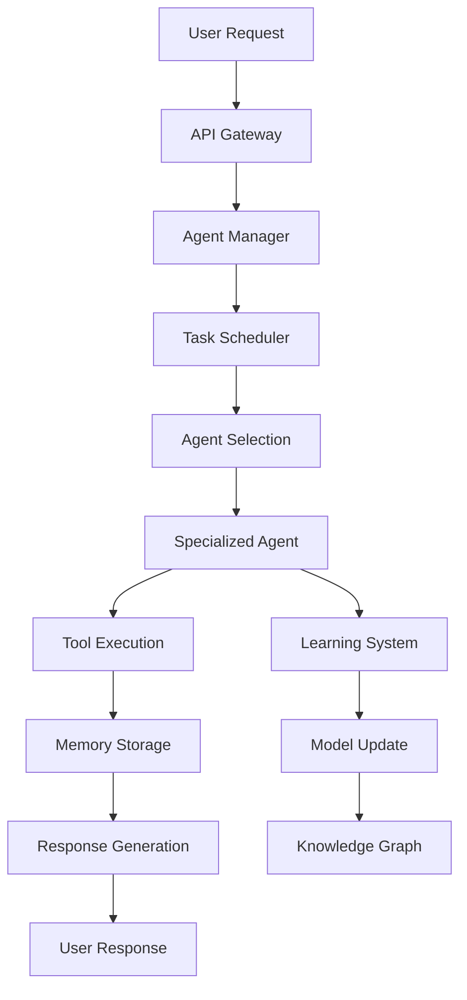
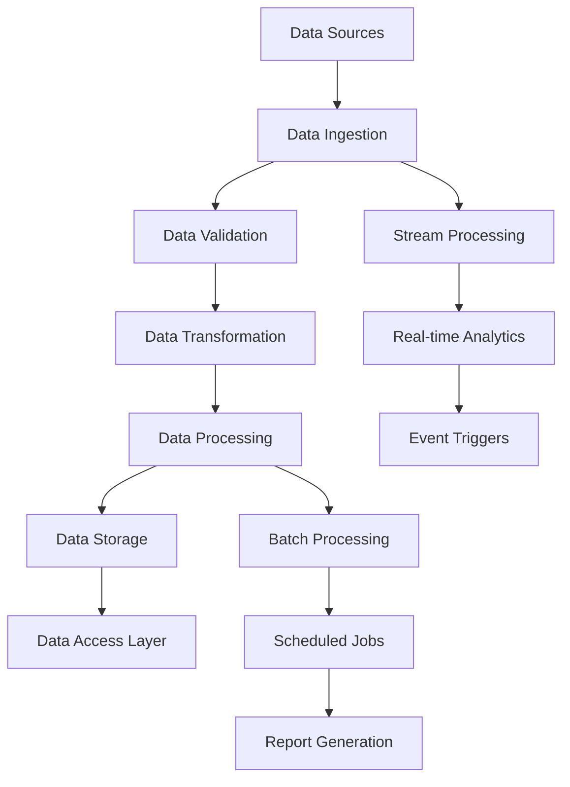
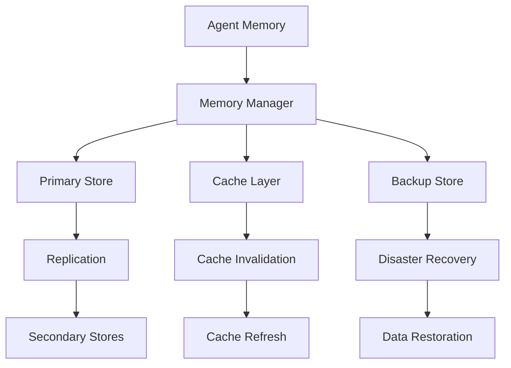

# DataMCPServerAgent System Architecture Blueprint

## 📋 Executive Summary

The DataMCPServerAgent is a sophisticated, enterprise-grade multi-agent system designed for large-scale data processing, intelligent automation, and adaptive learning. This blueprint provides a comprehensive overview of the system's architecture, components, interfaces, and data flows.

## 🎯 System Requirements

### Functional Requirements

- **Multi-Agent Orchestration**: Coordinate multiple specialized agents with different capabilities
- **Large-Scale Data Processing**: Handle terabytes of data with batch and stream processing
- **Adaptive Learning**: Continuous improvement through reinforcement learning and feedback
- **Memory Management**: Persistent, distributed memory across multiple storage backends
- **Real-Time Processing**: Low-latency stream processing for time-sensitive operations
- **Error Recovery**: Automatic error detection, recovery, and self-healing capabilities
- **Extensibility**: Plugin architecture for custom agents and tools

### Non-Functional Requirements

- **Scalability**: Horizontal scaling to handle increased load
- **Reliability**: 99.9% uptime with fault tolerance
- **Performance**: Sub-second response times for interactive operations
- **Security**: End-to-end encryption and secure credential management
- **Maintainability**: Modular design with clear separation of concerns
- **Observability**: Comprehensive monitoring and logging

## 🏗️ High-Level Architecture

```
┌─────────────────────────────────────────────────────────────────────────────────┐
│                           DataMCPServerAgent System                             │
├─────────────────────────────────────────────────────────────────────────────────┤
│                              Presentation Layer                                 │
│  ┌─────────────────┐  ┌─────────────────┐  ┌─────────────────┐                │
│  │   Web Interface │  │   CLI Interface │  │   API Gateway   │                │
│  │   (Future)      │  │   (Interactive) │  │   (REST/GraphQL)│                │
│  └─────────────────┘  └─────────────────┘  └─────────────────┘                │
├─────────────────────────────────────────────────────────────────────────────────┤
│                              Application Layer                                  │
│  ┌─────────────────────────────────────────────────────────────────────────────┐ │
│  │                        Agent Orchestration Layer                           │ │
│  │  ┌───────────────┐  ┌───────────────┐  ┌───────────────┐                  │ │
│  │  │ Agent Manager │  │ Task Scheduler│  │ Load Balancer │                  │ │
│  │  └───────────────┘  └───────────────┘  └───────────────┘                  │ │
│  └─────────────────────────────────────────────────────────────────────────────┘ │
│  ┌─────────────────────────────────────────────────────────────────────────────┐ │
│  │                           Specialized Agents                               │ │
│  │  ┌─────────────┐ ┌─────────────┐ ┌─────────────┐ ┌─────────────┐          │ │
│  │  │Research     │ │Trading      │ │SEO          │ │Memory       │          │ │
│  │  │Agent        │ │Agent        │ │Agent        │ │Agent        │          │ │
│  │  └─────────────┘ └─────────────┘ └─────────────┘ └─────────────┘          │ │
│  └─────────────────────────────────────────────────────────────────────────────┘ │
├─────────────────────────────────────────────────────────────────────────────────┤
│                              Processing Layer                                   │
│  ┌─────────────────────────────────────────────────────────────────────────────┐ │
│  │                        Data Pipeline System                                │ │
│  │  ┌───────────────┐  ┌───────────────┐  ┌───────────────┐                  │ │
│  │  │Pipeline       │  │Stream         │  │Batch          │                  │ │
│  │  │Orchestrator   │  │Processor      │  │Processor      │                  │ │
│  │  └───────────────┘  └───────────────┘  └───────────────┘                  │ │
│  └─────────────────────────────────────────────────────────────────────────────┘ │
│  ┌─────────────────────────────────────────────────────────────────────────────┐ │
│  │                        Learning & Intelligence                             │ │
│  │  ┌───────────────┐  ┌───────────────┐  ┌───────────────┐                  │ │
│  │  │Reinforcement  │  │Knowledge      │  │Error Recovery │                  │ │
│  │  │Learning       │  │Graph Engine   │  │System         │                  │ │
│  │  └───────────────┘  └───────────────┘  └───────────────┘                  │ │
│  └─────────────────────────────────────────────────────────────────────────────┘ │
├─────────────────────────────────────────────────────────────────────────────────┤
│                              Integration Layer                                  │
│  ┌─────────────────────────────────────────────────────────────────────────────┐ │
│  │                        External Integrations                               │ │
│  │  ┌───────────────┐  ┌───────────────┐  ┌───────────────┐                  │ │
│  │  │Bright Data    │  │Anthropic      │  │LangChain      │                  │ │
│  │  │MCP Server     │  │Claude API     │  │Tools          │                  │ │
│  │  └───────────────┘  └───────────────┘  └───────────────┘                  │ │
│  └─────────────────────────────────────────────────────────────────────────────┘ │
├─────────────────────────────────────────────────────────────────────────────────┤
│                              Data Layer                                         │
│  ┌─────────────────────────────────────────────────────────────────────────────┐ │
│  │                        Memory & Storage Systems                            │ │
│  │  ┌───────────────┐  ┌───────────────┐  ┌───────────────┐                  │ │
│  │  │Distributed    │  │Knowledge      │  │Cache Layer    │                  │ │
│  │  │Memory         │  │Graph Store    │  │(Redis)        │                  │ │
│  │  └───────────────┘  └───────────────┘  └───────────────┘                  │ │
│  │  ┌───────────────┐  ┌───────────────┐  ┌───────────────┐                  │ │
│  │  │Relational DB  │  │Document Store │  │Object Storage │                  │ │
│  │  │(PostgreSQL)   │  │(MongoDB)      │  │(S3/MinIO)     │                  │ │
│  │  └───────────────┘  └───────────────┘  └───────────────┘                  │ │
│  └─────────────────────────────────────────────────────────────────────────────┘ │
├─────────────────────────────────────────────────────────────────────────────────┤
│                              Infrastructure Layer                               │
│  ┌─────────────────────────────────────────────────────────────────────────────┐ │
│  │                        Monitoring & Operations                             │ │
│  │  ┌───────────────┐  ┌───────────────┐  ┌───────────────┐                  │ │
│  │  │Metrics        │  │Logging        │  │Health Checks  │                  │ │
│  │  │(Prometheus)   │  │(Structured)   │  │& Alerts       │                  │ │
│  │  └───────────────┘  └───────────────┘  └───────────────┘                  │ │
│  └─────────────────────────────────────────────────────────────────────────────┘ │
└─────────────────────────────────────────────────────────────────────────────────┘
```

## 🧩 Component Architecture

### 1. Agent Orchestration Layer

#### Agent Manager (`src/core/agent_manager.py`)

```python
class AgentManager:
    """Central coordinator for all agent instances"""
    - agent_registry: Dict[str, BaseAgent]
    - load_balancer: LoadBalancer
    - health_monitor: HealthMonitor
    
    + register_agent(agent: BaseAgent) -> str
    + get_agent(agent_id: str) -> BaseAgent
    + distribute_task(task: Task) -> TaskResult
    + monitor_agents() -> HealthStatus
```

#### Task Scheduler (`src/core/task_scheduler.py`)

```python
class TaskScheduler:
    """Manages task queuing and execution scheduling"""
    - task_queue: PriorityQueue
    - execution_pool: ThreadPoolExecutor
    - cron_scheduler: CronScheduler
    
    + schedule_task(task: Task, schedule: str) -> str
    + execute_immediate(task: Task) -> TaskResult
    + get_task_status(task_id: str) -> TaskStatus
```

### 2. Specialized Agent Components

#### Base Agent Architecture

```python
class BaseAgent(ABC):
    """Abstract base class for all agents"""
    - agent_id: str
    - memory_manager: MemoryManager
    - tool_registry: ToolRegistry
    - learning_system: LearningSystem
    
    @abstractmethod
    + process_request(request: AgentRequest) -> AgentResponse
    + learn_from_feedback(feedback: Feedback) -> None
    + get_capabilities() -> List[Capability]
```

#### Research Agent (`src/agents/research_agent.py`)

```python
class ResearchAgent(BaseAgent):
    """Specialized agent for research and information gathering"""
    - web_search_tool: WebSearchTool
    - document_analyzer: DocumentAnalyzer
    - citation_manager: CitationManager
    
    + conduct_research(query: str) -> ResearchReport
    + analyze_documents(docs: List[Document]) -> Analysis
    + generate_citations(sources: List[Source]) -> Citations
```

#### Trading Agent (`src/agents/trading_agent.py`)

```python
class TradingAgent(BaseAgent):
    """Specialized agent for financial analysis and trading"""
    - market_data_provider: MarketDataProvider
    - technical_analyzer: TechnicalAnalyzer
    - risk_manager: RiskManager
    
    + analyze_market(symbol: str) -> MarketAnalysis
    + generate_signals(data: MarketData) -> TradingSignals
    + assess_risk(position: Position) -> RiskAssessment
```

### 3. Data Pipeline System

#### Pipeline Orchestrator (`src/data_pipeline/core/orchestrator.py`)

```python
class PipelineOrchestrator:
    """Main orchestration engine for data pipelines"""
    - scheduler: PipelineScheduler
    - executor: PipelineExecutor
    - metrics: PipelineMetrics
    - active_pipelines: Dict[str, PipelineRun]
    
    + register_pipeline(config: PipelineConfig) -> Pipeline
    + trigger_pipeline(pipeline_id: str) -> str
    + monitor_execution(run_id: str) -> PipelineStatus
```

#### Data Ingestion System

```python
class DataIngestionSystem:
    """Handles data ingestion from multiple sources"""
    - batch_engine: BatchIngestionEngine
    - stream_engine: StreamIngestionEngine
    - connectors: Dict[str, DataConnector]
    
    + ingest_batch(source: DataSource) -> IngestionResult
    + setup_stream(stream_config: StreamConfig) -> StreamHandler
    + validate_data(data: DataFrame) -> ValidationResult
```

### 4. Memory & Learning Systems

#### Distributed Memory Manager (`src/memory/distributed_memory_manager.py`)

```python
class DistributedMemoryManager:
    """Manages distributed memory across multiple backends"""
    - primary_store: MemoryStore
    - cache_layer: CacheLayer
    - replication_manager: ReplicationManager
    
    + store_memory(memory: Memory) -> str
    + retrieve_memory(query: MemoryQuery) -> List[Memory]
    + synchronize_stores() -> SyncResult
```

#### Knowledge Graph Engine (`src/knowledge/knowledge_graph_engine.py`)

```python
class KnowledgeGraphEngine:
    """Manages knowledge representation and reasoning"""
    - graph_store: RDFStore
    - reasoner: SPARQLReasoner
    - entity_extractor: EntityExtractor
    
    + add_knowledge(facts: List[Fact]) -> None
    + query_knowledge(query: str) -> QueryResult
    + infer_relationships() -> List[Relationship]
```

## 🔄 Data Flow Architecture

### 1. Request Processing Flow



### 2. Data Pipeline Flow



### 3. Memory Synchronization Flow



## 🔌 Interface Specifications

### 1. Agent Communication Interface

```python
class AgentCommunicationProtocol:
    """Standard protocol for inter-agent communication"""
    
    @dataclass
    class Message:
        sender_id: str
        receiver_id: str
        message_type: MessageType
        payload: Dict[str, Any]
        timestamp: datetime
        correlation_id: str
    
    @dataclass
    class Response:
        message_id: str
        status: ResponseStatus
        data: Dict[str, Any]
        error: Optional[str]
```

### 2. Data Pipeline Interface

```python
class DataPipelineInterface:
    """Standard interface for data pipeline components"""
    
    @abstractmethod
    def process_data(self, data: Any, config: Dict[str, Any]) -> Any:
        """Process data according to configuration"""
        pass
    
    @abstractmethod
    def validate_config(self, config: Dict[str, Any]) -> ValidationResult:
        """Validate component configuration"""
        pass
    
    @abstractmethod
    def get_metrics(self) -> Dict[str, Any]:
        """Get component performance metrics"""
        pass
```

### 3. Memory Interface

```python
class MemoryInterface:
    """Standard interface for memory operations"""
    
    @abstractmethod
    async def store(self, key: str, value: Any, ttl: Optional[int] = None) -> bool:
        """Store data with optional TTL"""
        pass
    
    @abstractmethod
    async def retrieve(self, key: str) -> Optional[Any]:
        """Retrieve data by key"""
        pass
    
    @abstractmethod
    async def query(self, query: MemoryQuery) -> List[Any]:
        """Query data with complex criteria"""
        pass
```

## 📊 Data Models

### 1. Core Data Models

```python
@dataclass
class AgentRequest:
    request_id: str
    agent_type: str
    task_type: str
    parameters: Dict[str, Any]
    priority: int
    timeout: Optional[int]
    callback_url: Optional[str]

@dataclass
class AgentResponse:
    request_id: str
    agent_id: str
    status: ResponseStatus
    result: Dict[str, Any]
    execution_time: float
    error: Optional[str]
    metadata: Dict[str, Any]

@dataclass
class Memory:
    memory_id: str
    agent_id: str
    memory_type: MemoryType
    content: Dict[str, Any]
    timestamp: datetime
    importance: float
    tags: List[str]
    relationships: List[str]
```

### 2. Pipeline Data Models

```python
@dataclass
class PipelineConfig:
    pipeline_id: str
    name: str
    description: str
    tasks: List[TaskConfig]
    schedule: Optional[str]
    parameters: Dict[str, Any]
    notifications: Dict[str, Any]

@dataclass
class TaskConfig:
    task_id: str
    task_type: TaskType
    name: str
    depends_on: List[str]
    parameters: Dict[str, Any]
    retry_count: int
    timeout: Optional[int]

@dataclass
class DataSource:
    source_id: str
    source_type: DataSourceType
    connection_config: Dict[str, Any]
    schema_config: Optional[Dict[str, Any]]
    credentials: Optional[Dict[str, Any]]
```

## 🔒 Security Architecture

### 1. Authentication & Authorization

```python
class SecurityManager:
    """Manages authentication and authorization"""
    - auth_provider: AuthProvider
    - permission_manager: PermissionManager
    - encryption_service: EncryptionService
    
    + authenticate_user(credentials: Credentials) -> AuthToken
    + authorize_action(token: AuthToken, action: str) -> bool
    + encrypt_sensitive_data(data: Any) -> EncryptedData
```

### 2. Data Protection

- **Encryption at Rest**: All sensitive data encrypted using AES-256
- **Encryption in Transit**: TLS 1.3 for all network communications
- **Key Management**: Secure key rotation and storage
- **Access Control**: Role-based access control (RBAC)
- **Audit Logging**: Comprehensive audit trail for all operations

## 📈 Scalability & Performance

### 1. Horizontal Scaling

```python
class ScalingManager:
    """Manages horizontal scaling of components"""
    - load_monitor: LoadMonitor
    - auto_scaler: AutoScaler
    - cluster_manager: ClusterManager
    
    + scale_agents(target_count: int) -> ScalingResult
    + balance_load() -> LoadBalanceResult
    + monitor_performance() -> PerformanceMetrics
```

### 2. Performance Optimization

- **Connection Pooling**: Efficient database connection management
- **Caching Strategy**: Multi-level caching with Redis and in-memory caches
- **Async Processing**: Non-blocking I/O operations throughout the system
- **Resource Management**: Dynamic resource allocation based on load
- **Query Optimization**: Optimized database queries and indexing

## 🔍 Monitoring & Observability

### 1. Metrics Collection

```python
class MetricsCollector:
    """Collects and aggregates system metrics"""
    - prometheus_client: PrometheusClient
    - custom_metrics: CustomMetrics
    - alert_manager: AlertManager
    
    + collect_agent_metrics() -> AgentMetrics
    + collect_pipeline_metrics() -> PipelineMetrics
    + trigger_alerts(conditions: List[AlertCondition]) -> None
```

### 2. Logging Strategy

- **Structured Logging**: JSON-formatted logs with consistent schema
- **Log Aggregation**: Centralized log collection and analysis
- **Correlation IDs**: Request tracing across system components
- **Log Levels**: Configurable log levels for different environments
- **Log Retention**: Automated log rotation and archival

## 🚀 Deployment Architecture

### 1. Container Strategy

```dockerfile
# Multi-stage build for optimized containers
FROM python:3.11-slim as base
# Base dependencies and configuration

FROM base as development
# Development tools and debugging capabilities

FROM base as production
# Optimized production image
```

### 2. Orchestration

```yaml
# Kubernetes deployment configuration
apiVersion: apps/v1
kind: Deployment
metadata:
  name: datamcp-agent-system
spec:
  replicas: 3
  selector:
    matchLabels:
      app: datamcp-agent
  template:
    metadata:
      labels:
        app: datamcp-agent
    spec:
      containers:
      - name: agent-system
        image: datamcp-agent:latest
        resources:
          requests:
            memory: "1Gi"
            cpu: "500m"
          limits:
            memory: "2Gi"
            cpu: "1000m"
```

## 🔄 Integration Patterns

### 1. Event-Driven Architecture

```python
class EventBus:
    """Central event bus for system-wide communication"""
    - event_store: EventStore
    - subscribers: Dict[str, List[EventHandler]]
    - publisher: EventPublisher
    
    + publish_event(event: Event) -> None
    + subscribe(event_type: str, handler: EventHandler) -> str
    + replay_events(from_timestamp: datetime) -> List[Event]
```

### 2. API Gateway Pattern

```python
class APIGateway:
    """Central entry point for all external requests"""
    - rate_limiter: RateLimiter
    - auth_middleware: AuthMiddleware
    - request_router: RequestRouter
    
    + route_request(request: HTTPRequest) -> HTTPResponse
    + apply_rate_limiting(client_id: str) -> bool
    + authenticate_request(request: HTTPRequest) -> AuthResult
```

This architectural blueprint provides a comprehensive foundation for understanding, implementing, and scaling the DataMCPServerAgent system. Each component is designed with modularity, scalability, and maintainability in mind, ensuring the system can evolve with changing requirements and growing data processing needs.
