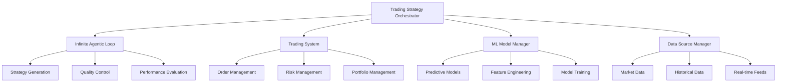

# Trading Infinite Loop System - Complete Guide

## 🚀 Overview

The Trading Infinite Loop System combines the power of the Infinite Agentic Loop with advanced trading capabilities to automatically generate, test, and deploy profitable trading strategies. This system continuously evolves trading strategies using AI agents, backtesting, and performance optimization.

## 🏗️ Architecture

### System Components



### Key Features

- **🔄 Infinite Strategy Generation**: Continuously generates new trading strategies
- **🧪 Automated Backtesting**: Tests strategies on historical data
- **📊 Performance Optimization**: Evolves strategies based on performance metrics
- **⚡ Real-time Deployment**: Deploys successful strategies for live trading
- **🛡️ Risk Management**: Built-in risk controls and compliance
- **📈 Performance Monitoring**: Real-time strategy performance tracking

## 🚀 Quick Start

### 1. Installation

```bash
# Clone the repository
git clone https://github.com/your-repo/DataMCPServerAgent.git
cd DataMCPServerAgent

# Install dependencies
pip install -r requirements.txt

# Install additional trading dependencies
pip install ccxt pandas numpy scikit-learn matplotlib

# Set up environment variables
cp .env.example .env
# Edit .env with your API keys and configuration
```

### 2. Configuration

```python
from src.agents.trading_infinite_loop.trading_strategy_orchestrator import TradingStrategyConfig

# Create configuration
config = TradingStrategyConfig(
    target_symbols=["BTC/USDT", "ETH/USDT", "BNB/USDT"],
    strategy_types=["momentum", "mean_reversion", "arbitrage"],
    risk_tolerance=0.02,  # 2% max risk per trade
    min_profit_threshold=0.005,  # 0.5% minimum profit
    backtest_period_days=30,
    min_sharpe_ratio=1.5,
    max_drawdown=0.1,
    min_win_rate=0.6
)
```

### 3. Start Strategy Generation

```python
import asyncio
from src.agents.trading_infinite_loop.trading_strategy_orchestrator import TradingStrategyOrchestrator

async def main():
    # Initialize orchestrator
    orchestrator = TradingStrategyOrchestrator(
        model=model,
        tools=tools,
        trading_system=trading_system,
        config=config
    )
    
    # Generate strategies
    results = await orchestrator.generate_trading_strategies(
        count="infinite",  # or specific number like 100
        output_dir="./generated_strategies"
    )
    
    print(f"Generation started: {results}")

asyncio.run(main())
```

## 🔧 API Usage

### REST API Endpoints

#### Start Strategy Generation

```bash
curl -X POST "http://localhost:8001/api/trading-infinite-loop/generate" \
  -H "Content-Type: application/json" \
  -d '{
    "count": 50,
    "target_symbols": ["BTC/USDT", "ETH/USDT"],
    "strategy_types": ["momentum", "mean_reversion"],
    "risk_tolerance": 0.02,
    "min_profit_threshold": 0.005,
    "backtest_period_days": 30
  }'
```

Response:
```json
{
  "success": true,
  "session_id": "uuid-session-id",
  "message": "Strategy generation started",
  "estimated_time": "5-30 minutes depending on count",
  "status_endpoint": "/api/trading-infinite-loop/status/uuid-session-id"
}
```

#### Check Generation Status

```bash
curl "http://localhost:8001/api/trading-infinite-loop/status/{session_id}"
```

Response:
```json
{
  "session_id": "uuid-session-id",
  "status": "running",
  "progress": 0.65,
  "strategies_generated": 32,
  "strategies_accepted": 18,
  "current_wave": 5,
  "execution_time": 1250.5,
  "errors": []
}
```

#### List Generated Strategies

```bash
curl "http://localhost:8001/api/trading-infinite-loop/strategies?limit=10&sort_by=performance"
```

#### Deploy Strategy

```bash
curl -X POST "http://localhost:8001/api/trading-infinite-loop/strategies/{strategy_id}/deploy" \
  -H "Content-Type: application/json" \
  -d '{
    "allocation": 0.1,
    "max_position_size": 0.05,
    "stop_loss": 0.02
  }'
```

## 📊 Strategy Configuration

### Strategy Types

#### 1. Momentum Strategies
```python
config = TradingStrategyConfig(
    strategy_types=["momentum"],
    # Momentum-specific parameters
    momentum_lookback_period=14,
    momentum_threshold=0.02
)
```

#### 2. Mean Reversion Strategies
```python
config = TradingStrategyConfig(
    strategy_types=["mean_reversion"],
    # Mean reversion parameters
    bollinger_period=20,
    bollinger_std=2.0,
    rsi_period=14,
    rsi_oversold=30,
    rsi_overbought=70
)
```

#### 3. Arbitrage Strategies
```python
config = TradingStrategyConfig(
    strategy_types=["arbitrage"],
    # Arbitrage parameters
    min_spread=0.001,  # 0.1% minimum spread
    max_execution_time=5  # 5 seconds max execution
)
```

#### 4. ML-Based Strategies
```python
config = TradingStrategyConfig(
    strategy_types=["ml_based"],
    # ML parameters
    feature_lookback=60,
    model_retrain_frequency=24,  # hours
    prediction_horizon=4  # hours
)
```

### Risk Management

```python
config = TradingStrategyConfig(
    # Position sizing
    max_position_size=0.1,  # 10% of portfolio
    position_sizing_method="kelly",  # or "fixed", "volatility_adjusted"
    
    # Risk controls
    max_daily_loss=0.05,  # 5% max daily loss
    max_drawdown=0.15,  # 15% max drawdown
    stop_loss_pct=0.02,  # 2% stop loss
    take_profit_pct=0.06,  # 6% take profit
    
    # Correlation limits
    max_correlation=0.7,  # Max correlation between positions
    sector_concentration_limit=0.3  # Max 30% in one sector
)
```

## 🧪 Testing and Validation

### Running Tests

```bash
# Run all tests
pytest tests/ -v

# Run specific test categories
pytest tests/test_trading_infinite_loop.py -v
pytest tests/performance/ -v

# Run with coverage
pytest tests/ --cov=src --cov-report=html
```

### Performance Benchmarking

```bash
# Run comprehensive benchmark
python tests/performance/benchmark_trading_loop.py

# Run specific benchmarks
python -c "
import asyncio
from tests.performance.benchmark_trading_loop import PerformanceBenchmark

async def main():
    benchmark = PerformanceBenchmark()
    results = await benchmark.benchmark_strategy_generation_throughput()
    print(results)

asyncio.run(main())
"
```

### Backtesting Validation

```python
from src.agents.trading_infinite_loop.trading_strategy_orchestrator import TradingStrategyOrchestrator

# Validate strategy performance
async def validate_strategy(strategy_id: str):
    orchestrator = TradingStrategyOrchestrator(...)
    
    # Run extended backtest
    backtest_results = await orchestrator._backtest_strategy(
        strategy_data=strategy,
        start_date=datetime.now() - timedelta(days=365),  # 1 year
        end_date=datetime.now()
    )
    
    # Validate performance metrics
    metrics = backtest_results["metrics"]
    assert metrics["sharpe_ratio"] >= 1.5
    assert metrics["max_drawdown"] >= -0.1
    assert metrics["win_rate"] >= 0.6
    
    return backtest_results
```

## 📈 Performance Optimization

### High-Frequency Trading Optimizations

```python
config = TradingStrategyConfig(
    # Performance settings
    async_execution=True,
    batch_processing=True,
    memory_optimization=True,
    
    # HFT-specific settings
    max_latency_ms=10,  # 10ms max latency
    order_execution_timeout=1,  # 1 second timeout
    market_data_buffer_size=1000,
    
    # Parallel processing
    max_parallel_agents=20,
    wave_size_max=10,
    context_threshold=0.9
)
```

### Memory Optimization

```python
# Configure memory-efficient processing
config = TradingStrategyConfig(
    # Memory settings
    strategy_cache_size=100,  # Keep 100 strategies in memory
    backtest_data_compression=True,
    lazy_loading=True,
    
    # Garbage collection
    gc_frequency=10,  # Run GC every 10 strategies
    memory_limit_mb=2048  # 2GB memory limit
)
```

### Database Optimization

```python
# Configure database for high-performance
DATABASE_CONFIG = {
    "connection_pool_size": 20,
    "max_overflow": 30,
    "pool_timeout": 30,
    "pool_recycle": 3600,
    
    # Query optimization
    "query_cache_size": 1000,
    "bulk_insert_batch_size": 1000,
    
    # Indexing
    "create_indexes": [
        "idx_strategy_performance",
        "idx_backtest_results_date",
        "idx_trades_symbol_timestamp"
    ]
}
```

## 🔍 Monitoring and Alerting

### Real-time Monitoring

```python
from src.monitoring.trading_monitor import TradingMonitor

# Set up monitoring
monitor = TradingMonitor(
    alert_channels=["email", "slack", "webhook"],
    performance_thresholds={
        "min_sharpe_ratio": 1.0,
        "max_drawdown": 0.2,
        "min_win_rate": 0.5
    }
)

# Monitor strategy performance
await monitor.start_monitoring(strategy_ids=["strategy_1", "strategy_2"])
```

### Performance Alerts

```python
# Configure alerts
ALERT_CONFIG = {
    "performance_degradation": {
        "threshold": 0.1,  # 10% performance drop
        "window": "1h",
        "action": "pause_strategy"
    },
    "high_drawdown": {
        "threshold": 0.15,  # 15% drawdown
        "action": "stop_strategy"
    },
    "system_errors": {
        "error_rate": 0.05,  # 5% error rate
        "window": "5m",
        "action": "alert_admin"
    }
}
```

## 🛠️ Troubleshooting

### Common Issues

#### 1. Strategy Generation Slow
```python
# Optimize configuration
config = TradingStrategyConfig(
    max_parallel_agents=10,  # Increase parallel processing
    batch_processing=True,   # Enable batch processing
    async_execution=True     # Enable async execution
)
```

#### 2. High Memory Usage
```python
# Reduce memory footprint
config = TradingStrategyConfig(
    strategy_cache_size=50,      # Reduce cache size
    memory_optimization=True,    # Enable memory optimization
    backtest_period_days=14      # Reduce backtest period
)
```

#### 3. Poor Strategy Performance
```python
# Increase quality thresholds
config = TradingStrategyConfig(
    min_sharpe_ratio=2.0,        # Higher Sharpe ratio requirement
    max_drawdown=0.05,           # Lower drawdown tolerance
    min_win_rate=0.7,            # Higher win rate requirement
    quality_threshold=0.8        # Higher overall quality threshold
)
```

### Debug Mode

```python
import logging

# Enable debug logging
logging.basicConfig(level=logging.DEBUG)

# Configure detailed logging
config = TradingStrategyConfig(
    log_level="DEBUG",
    detailed_logging=True
)
```

## 🔐 Security and Compliance

### API Security

```python
# Configure API security
API_CONFIG = {
    "authentication": "jwt",
    "rate_limiting": {
        "requests_per_minute": 100,
        "burst_limit": 20
    },
    "encryption": "AES-256",
    "audit_logging": True
}
```

### Trading Compliance

```python
# Configure compliance checks
COMPLIANCE_CONFIG = {
    "position_limits": {
        "max_position_size": 0.1,
        "max_leverage": 3.0,
        "max_concentration": 0.3
    },
    "risk_controls": {
        "daily_loss_limit": 0.05,
        "monthly_loss_limit": 0.15,
        "var_limit": 0.02
    },
    "reporting": {
        "trade_reporting": True,
        "position_reporting": True,
        "pnl_reporting": True
    }
}
```

## 📚 Additional Resources

### Documentation
- [API Reference](./api_reference.md)
- [Strategy Development Guide](./strategy_development.md)
- [Performance Tuning](./performance_tuning.md)
- [Deployment Guide](./deployment.md)

### Examples
- [Basic Strategy Generation](./examples/basic_generation.py)
- [Advanced Configuration](./examples/advanced_config.py)
- [Custom Strategy Types](./examples/custom_strategies.py)
- [Performance Monitoring](./examples/monitoring.py)

### Support
- GitHub Issues: [Report bugs and feature requests](https://github.com/your-repo/issues)
- Documentation: [Complete documentation](https://docs.your-domain.com)
- Community: [Join our Discord](https://discord.gg/your-invite)

## 🤝 Contributing

We welcome contributions! Please see our [Contributing Guide](./CONTRIBUTING.md) for details on:
- Code style and standards
- Testing requirements
- Pull request process
- Development setup

## 📄 License

This project is licensed under the MIT License - see the [LICENSE](./LICENSE) file for details.
